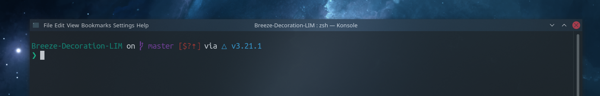

## breeze-decoration

Breeze window decoration theme for KWin.

Please note that I have only updated the close button, maximize button and minimze button to match breeze

### Locally Integrated Menus

This hides the AppMenu icon button and draws the menu in the titlebar.


Make sure you add the AppMenu button in System Settings > Application Style > Window Decorations > Buttons Tab.


### Installation

#### Building from source
Build dependencies:

- Ubuntu:
```
sudo apt build-dep breeze
sudo apt build-dep kwin
```


Download the source:

```
cd ~/Downloads
git clone https://github.com/Zren/material-decoration.git
cd material-decoration
```

Then compile the decoration, and install it:

```
mkdir build
cd build
cmake -DCMAKE_INSTALL_PREFIX=/usr ..
make
sudo make install
```

Select Material in System Settings > Application Style > Window Decorations.

To test changes, restart `kwin_x11` with:

```
QT_LOGGING_RULES="*=false;kdecoration.material=true" kstart5 -- kwin_x11 --replace
```

### Update

#### Building from source

First navigate to the source directory, and `git pull` recent changes.

```
cd ~/Downloads/material-decoration
git pull origin master --ff-only
```

Then re-run the install instructions.
